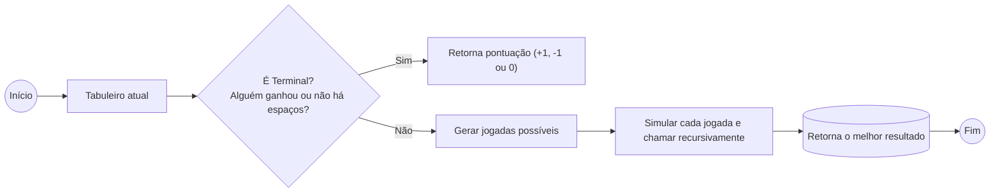
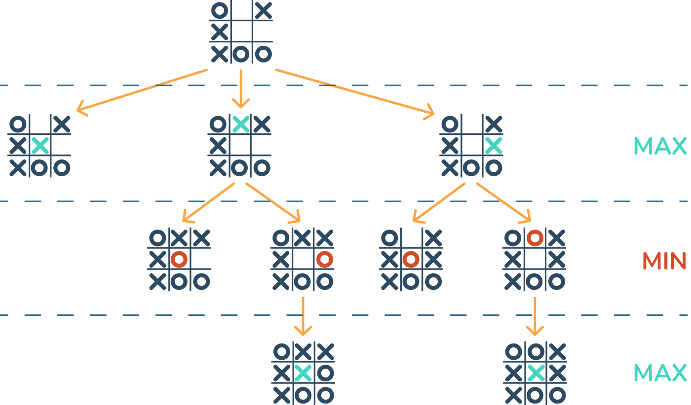

# Jogo da Velha (Tic Tac Toe) com Inteligência Artificial (Minimax)

Este projeto traz um **Jogo da Velha** (também conhecido como **Tic Tac Toe**) em Python, utilizando a biblioteca **Pygame** para criar uma interface gráfica e sons divertidos, além de usar um **algoritmo de Inteligência Artificial chamado Minimax** para tomar as decisões de jogada do computador.

---

## Sumário

1. [Visão Geral](#visão-geral)  
2. [Estrutura do Projeto](#estrutura-do-projeto)  
3. [Instalação e Execução](#instalação-e-execução)  
4. [Como Jogar](#como-jogar)  
5. [Entendendo o Minimax](#entendendo-o-minimax)  
6. [Imagens e Demonstrações](#imagens-e-demonstrações)  
7. [Possíveis Melhorias](#possíveis-melhorias)  
8. [Licença](#licença)

---

## Visão Geral

- **O que é?**  
  Um jogo clássico de Jogo da Velha, onde você pode escolher jogar como **X** ou como **O**. Você faz sua jogada clicando em um quadradinho vazio, e o computador responde usando uma estratégia de IA (Minimax).

- **Por que é especial?**  
  - Utiliza **Pygame** para a parte gráfica (desenhar a tela, botões, efeitos) e para tocar **sons**.  
  - O **algoritmo Minimax** faz o computador jogar de forma ideal, tornando o desafio maior para o jogador.  
  - Há **efeitos visuais** de explosão quando uma jogada é feita, e até mesmo uma **animação de carregamento** para dar um clima divertido.

- **Para quem é?**  
  - Para iniciantes que querem aprender sobre **jogos em Python**.  
  - Para quem deseja entender **IA básica** e o algoritmo **Minimax** aplicado a um jogo simples. 

---

## Estrutura do Projeto

Dentro da pasta do projeto, você encontrará:

```
tictactoe
│
├── assets/
│   ├── fake_load.mp3
│   ├── loser.mp3
│   ├── maquina_click.mp3
│   ├── player_click.mp3
│   ├── trilha_sonora.mp3
│   └── ...
│
├── tictactoe.py             # Módulo principal com a lógica do jogo e IA (Minimax)
├── runner.py                # Arquivo que roda o jogo com Pygame (interface gráfica)
├── requirements.txt         # Dependências (principalmente pygame)
├── README.md                # Este arquivo que você está lendo :)
└── ...
```

- **tictactoe.py**: Contém toda a parte de **lógica** do Jogo da Velha, incluindo o **Minimax**.  
- **runner.py**: Carrega a parte visual (com **Pygame**), desenha o tabuleiro, trata cliques do mouse e toca sons.  
- **requirements.txt**: Lista de bibliotecas necessárias para rodar o projeto.

---

## Instalação e Execução

### 1. Pré-requisitos

- **Python 3** instalado no seu computador.  
- Ter o **Pip** (gerenciador de pacotes do Python) funcionando corretamente.

### 2. Crie (opcional) e ative um ambiente virtual

No terminal (ou prompt de comando), dentro da pasta do projeto:

```bash
python -m venv venv
```

No Windows:
```bash
venv\Scripts\activate
```

No Mac/Linux:
```bash
source venv/bin/activate
```

### 3. Instale as dependências

Ainda no terminal:

```bash
pip install -r requirements.txt
```

> Caso dê erro, tente `pip3 install -r requirements.txt`, dependendo de como o Python está configurado.

### 4. Execute o jogo

No terminal, dentro da pasta do projeto:

```bash
python runner.py
```

> Se você estiver em ambiente virtual, lembre de ativá-lo antes.

### 5. Divirta-se!

Quando o jogo abrir, você verá a **tela de seleção** para escolher se quer jogar como **X** ou **O**. É só clicar no botão correspondente.

---

## Como Jogar

1. **Escolha seu símbolo**: Na tela inicial, clique em “Jogar como X” ou “Jogar como O”.  
2. **Espere o "carregando..."**: Há uma rápida animação de “Carregando...”.  
3. **Jogue**: Clique em qualquer quadrado vazio para fazer sua jogada.  
4. **Aguarde a jogada do computador**: Ele pensa rapidinho (às vezes com uma pequena espera) e faz a jogada.  
5. **Ganhe, perca ou empate**: Se alguém fizer uma linha, coluna ou diagonal com o mesmo símbolo, o jogo termina. Caso ninguém consiga, é empate.  
6. **Jogue novamente**: Se quiser, clique em “Jogar Novamente” para reiniciar.

---

## Entendendo o Minimax

Imagine que você tem uma **árvore de decisões**:

1. **Você** escolhe um movimento (por exemplo, colocar X em algum quadrado).  
2. **O Computador** olha todos os movimentos que ele poderia fazer depois da sua jogada.  
3. O Computador imagina *“Se eu fizer este movimento, como o jogador vai responder?”* e tenta sempre **puxar a situação para um resultado melhor para ele** (e pior para você).

### Passo a Passo Simplificado

1. **Olhar todas as casas vazias** no tabuleiro.  
2. Para cada casa vazia, imaginar que você (ou o computador) faz uma jogada ali.  
3. **Verificar se o jogo acabou**:  
   - Se sim, dar uma pontuação: **+1** se X ganhou, **-1** se O ganhou, ou **0** se deu empate.  
4. **Se o jogo não acabou**, continuar **desenhando cenários** (a árvore de possibilidades).  
5. **Se for a vez do X**, ele quer **maximizar** a pontuação (tentar chegar ao +1).  
6. **Se for a vez do O**, ele quer **minimizar** a pontuação (tentar chegar ao -1).

No final, o computador escolhe a jogada que o leva ao melhor desfecho para ele, considerando que você também vai jogar o melhor possível para si.

### Fluxo Simplificado do Minimax



> **Terminal** significa que o jogo acabou: ou alguém venceu, ou deu empate.

---

## Imagens e Demonstrações

1. **Partida em andamento**  
    <iframe width="560" height="315" src="https://www.youtube.com/embed/nYb2NjOzD5A" frameborder="0" allowfullscreen></iframe>


2. **Árvore de decisão do Minimax (Exemplo ilustrativo)**  
   

---

## Possíveis Melhorias

- **Níveis de Dificuldade**: Ajustar a profundidade do Minimax para ter modos “Fácil”, “Médio” e “Difícil”.  
- **Interface Mais Bonita**: Adicionar imagens personalizadas, animações mais elaboradas ou um fundo musical mais sofisticado.  
- **Outras Regras**: Permitir tabuleiros maiores (4x4, 5x5).  
- **Jogador vs. Jogador Online**: Fazer com que duas pessoas possam jogar pela internet.

---

## Licença

Este projeto é livre para estudos e modificações. Você pode usar, modificar e distribuir à vontade, mas lembre de dar os créditos necessários aos autores originais.

---

# Divirta-se!
Sinta-se à vontade para contribuir, relatar problemas ou dar sugestões.  
**Bom jogo e bons estudos!**#
